# Provision Cloud Resources Using Resource Manager

**Resource Manager** is an Oracle Cloud Infrastructure service that allows you to automate the process of provisioning your Oracle Cloud Infrastructure resources. In this section you will use **Resource Manager** to provision the resources required for this solution.

> **Resource Manager** uses Terraform to help install, configure, and manage cloud resources through the "infrastructure-as-code" model. Click [here](https://docs.cloud.oracle.com/en-us/iaas/Content/ResourceManager/Concepts/resourcemanager.htm) to learn more about Resource Manager.

### Prerequisites

* [Download](./tf/vcn-compute.zip) the prebuilt Terraform script for this solution.

## Provisioning Steps

### STEP 1 : Sign In to Oracle Cloud Infrastructure Console

Sign in to your **Cloud Account** from Oracle Cloud website. You will be prompted to enter your cloud tenant, user name, and password.

> For detailed sign in instructions, refer to the documentation on [*Getting Started with Oracle Cloud*](https://docs.oracle.com/en/cloud/get-started/subscriptions-cloud/csgsg/sign-your-account-oracle-cloud-website.html).

### STEP 2 : Create the Stack

Creating a **Stack** involves uploading the Terraform configuration file, providing identifying information for the new stack, and (optionally) setting the variables.

> A **Stack** is a collection of Oracle Cloud Infrastructure resources corresponding to a given Terraform configuration. Each stack resides in the **Compartment** you specify, in a single **Region**. However, resources in a given stack can be deployed across multiple regions.

1. Open the **Navigation Menu** on the top-left. Under **Solutions and Platform**, locate **Resource Manager** and click **Stacks**.

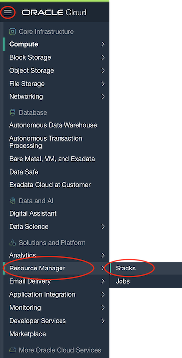

2. Choose a **Compartment** that you have permission to work in (towards the left of the page), and ensure you are in the correct **Region** (towards the top of the page). Click **Create Stack**.

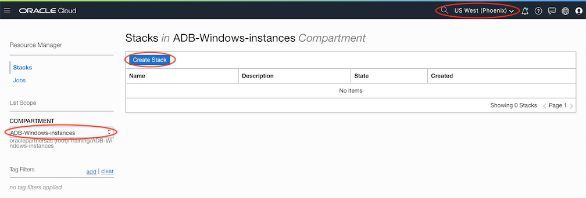

3. In the **Create Stack** dialog, enter the following :

	* Add the Terraform configuration file (**vcn-compute.zip**) that you've downloaded earlier. You can either drag and drop it onto the dialog box or click **Browse** and navigate to the file location.
	
	* Enter a **Name** for the new stack (or accept the default name provided).
	
	* Optionally, enter a **Description**.
	
	* From the **Create in Compartment** drop-down, select the **Compartment** where you want to create the stack.
	
	* Select the **Terraform Version** as **0.11.x**. 
		>The Terraform version is not backwards compatible so ensure you select the correct version.

	* Optionally, you can apply tags. 
		>Refer to the documentation section [*Tagging Overview*](https://docs.cloud.oracle.com/en-us/iaas/Content/Tagging/Concepts/taggingoverview.htm) for details on OCI Tagging.
		
	* Click **Next**.

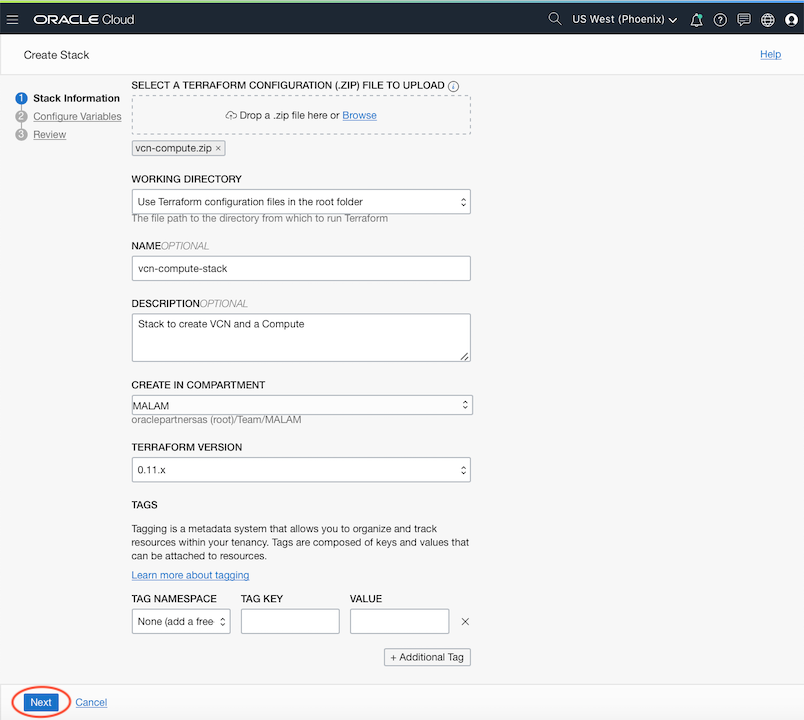

4. Configure the variables the cloud resources will require when creating the Stack, and also when you run the Apply job (next Step). Enter the following values in this dialog :

	* **Tenancy OCID** & **Compartment OCID**.

		>Click [here](https://docs.cloud.oracle.com/en-us/iaas/Content/General/Concepts/identifiers.htm) for the steps on locating your **Tenancy** and **Compartment OCIDs**.

	* Enter the Cloud **Region**'s identifier where you like the resources to be created. 

		>Refer to the documentation on [Cloud Regions](https://docs.cloud.oracle.com/en-us/iaas/Content/General/Concepts/regions.htm) to get the identifier for the region.

	* Enter the **Public Key** to be used by the VM (public key begins with **ssh-rsa** as in the below screeshot).

		>Refer to the tutorial on [Generating an SSH Key Pair for Oracle Compute Cloud Service Instances](https://www.oracle.com/webfolder/technetwork/tutorials/obe/cloud/compute-iaas/generating_ssh_key/generate_ssh_key.html).

	* Click **Next**.

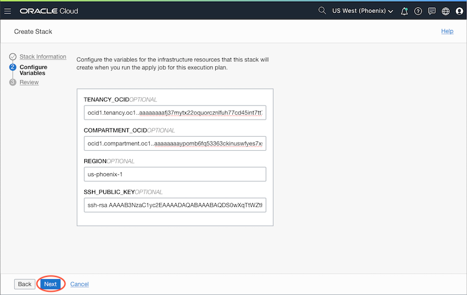

5. In the **Review** panel, verify your stack configuration.
Click **Create** to create the Stack.	

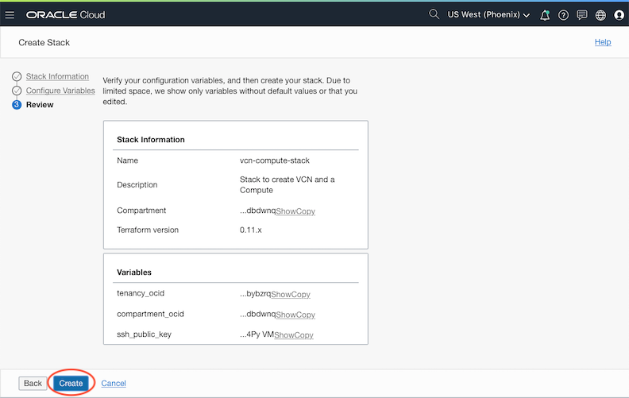

6. Verify the Stack creation on the **Stack Details** page. 

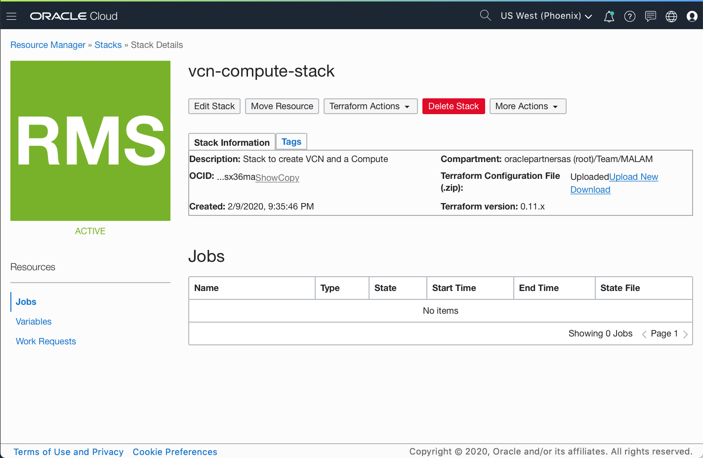

### STEP 3 : Run a Plan Job

Running a plan job parses the Terraform configuration (.zip) file and converts it into an execution plan listing resources and actions that will result when an apply job is run. We recommend generating the execution plan before running an apply job.

1. On the previous **Stack Details** page, click on **Terraform Actions** -> **Plan**.


2. Review the plan job **Name** and update if needed. Click **Plan**.

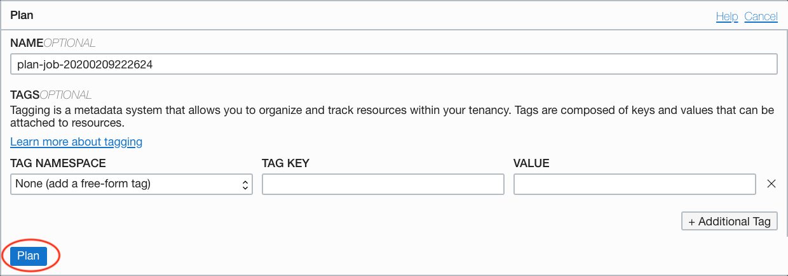

3. The new plan job is listed under **Jobs**, with an initial state of **Accepted**. Soon the status changes to **In Progress**. 


4. When the plan job is successful, the status will change to **Succeeded**.


5. Scroll to the bottom of the plan log and verify there are no errors, and the plan indicates the resources will be added. 

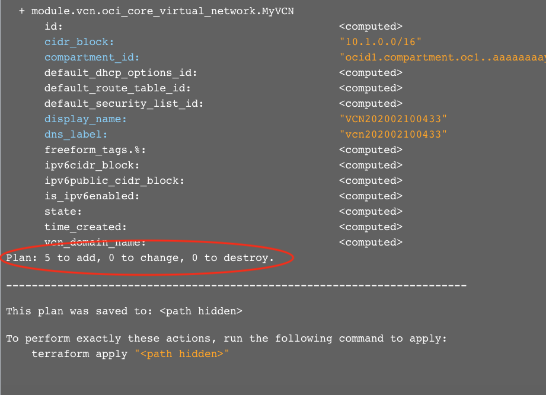

### STEP 4 : Run an Apply Job

When you run an apply job for a Stack, Terraform creates the resources and executes the actions defined in the Terraform configuration (.zip) file. The time required to complete an apply job depends on the number and type of cloud resources to be created.

1. Browse to the **Stack Details** page by clicking the link from the breadcrumbs as follows :

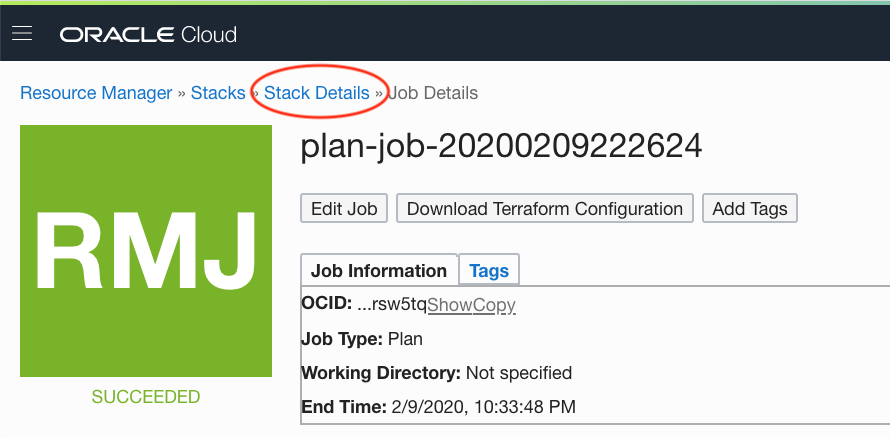

2. Go to **Terraform Actions** and select **Apply**.

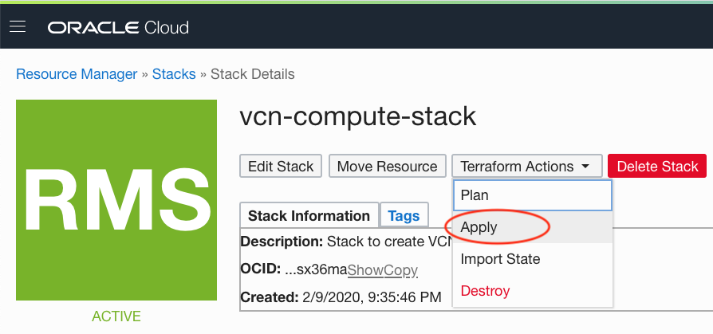

3. In the **Apply** dialog, review the apply job **Name** and ensure the **Apply Job Plan Resolution** is set to **Automatically Approve**.

	> You may optionally add **Tag** information. Refer to the documentation section [*Tagging Overview*](https://docs.cloud.oracle.com/en-us/iaas/Content/Tagging/Concepts/taggingoverview.htm) for details on OCI Tagging.

4. Click **Apply**.


5. The new apply job gets **Accepted** status. 


6. The apply job status will quickly change to **In Progress**. 

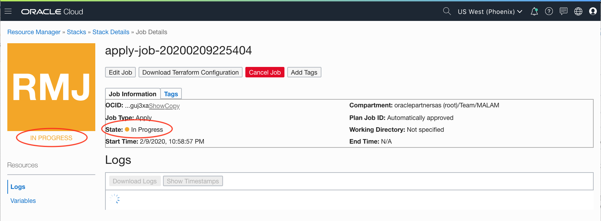

7. The job will take a few minutes to complete and will change status to **Succeeded** when successfully completed.


8. Verify the apply log by scrolling down to the **log** section and validate the resource creation was successful.

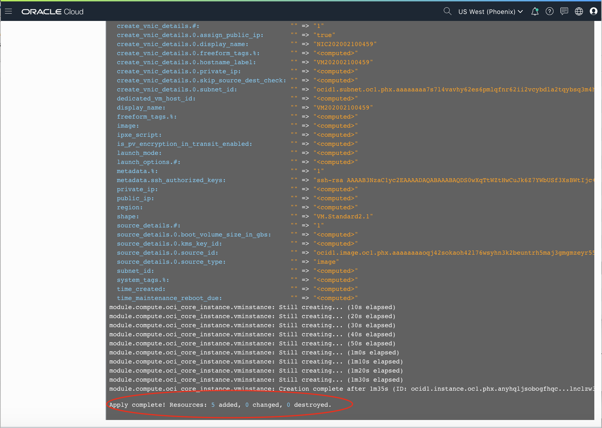

### STEP 5 : Validate the Cloud Resources

This solution creates the following Oracle Cloud resources :

* Linux VM
* Virtual Cloud Network

Complete the following steps to validate the cloud resources created. 

#### 5-1 : Validate Connectivity to the Linux VM

You connect to a running instance by using a Secure Shell (SSH) connection. Most Linux distributions include an SSH client by default. For Windows, you can download a free SSH client called PuTTY from [http://www.putty.org](http://www.putty.org).

**Get the Public IP Address of the Linux VM**

1. Navigate to the Linux VM that was created in your compartment from the Navigation Menu on the left and select **Compute** -> **Instances**. 

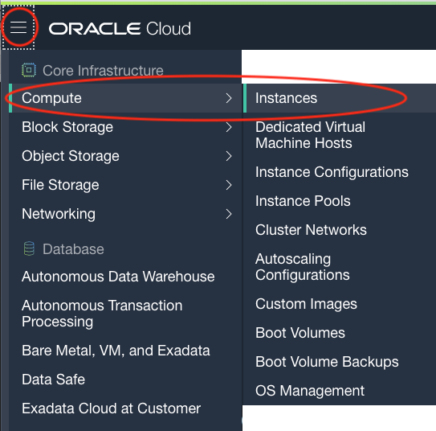

2. Click on the instance that was just created (instance name starts with **VM**).


3. On the **Instance Details** page, locate the Public IP Address of the VM as follows :

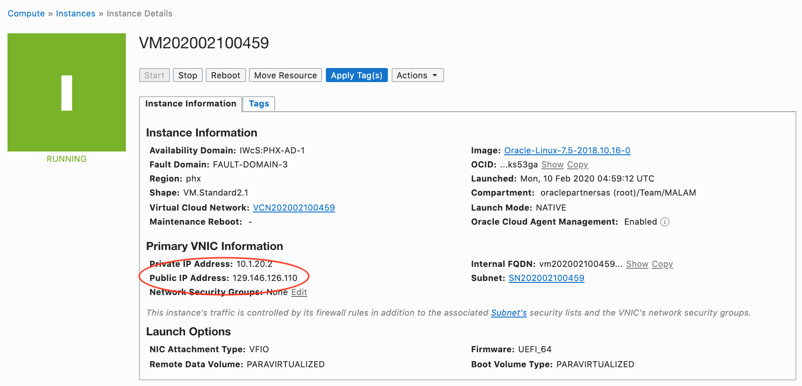

**Connecting From a Unix-style System**

1. Locate the SSH private key of the pair used for the VM (The public key of the pair was specified at Stack creation time).

2. Use the following command to set the file permissions so that only you can read the file :

```
$ chmod 400 <private_key>
```
>Where **\<private_key\>** is the full path and name of the file that contains the private key associated with the instance.

3. Use the following SSH command to access the instance.

```
$ ssh –i <private_key> opc@<public-ip-address>
```

>Where **\<public-ip-address\>** is your instance IP address that you retrieved from the Console.
>
>Also, If this is your first time connecting to the instance, you might see a message that the server's host key is not cached in the registry. Click Yes to continue the connection.

4. The following is a screenshot of a successful connection.


**Connecting From a Windows System**

1. Open putty.exe.

2. In the **Category** pane, expand **Window**, and then select **Translation**.

3. In the **Remote Character Set** drop-down list, select UTF-8. The default locale setting on Linux-based instances is UTF-8, and this configures PuTTY to use the same locale.

4. In the **Category** pane, select **Session** and enter the following:

	* Host Name (or IP address): **opc@\<public-ip-address\>**
	* Port: **22**
	* Connection type: **SSH**

	Where \<public-ip-address\> is your instance public IP address that you retrieved from the Console.

5. In the **Category** pane, expand **Connection**, expand **SSH**, and then click **Auth**.

6. Click **Browse**, and then select your private key in **PPK** format (Use **PuttyGen** to convert the private key to PPK format)

7. Click **Open** to start the session.

> If this is your first time connecting to the instance, you might see a message that the server's host key is not cached in the registry. Click Yes to continue the connection.

8. The following is a screenshot of a successful connection.

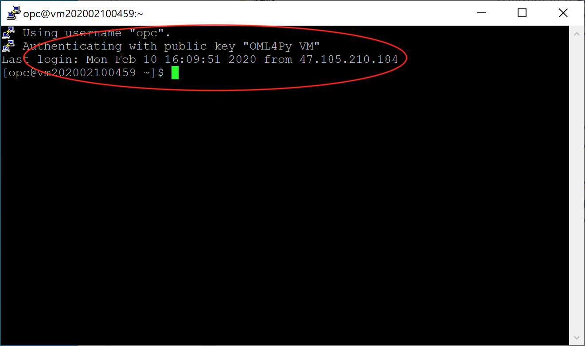

### Summary

You have successfully created the resoruces required for this solution. 

